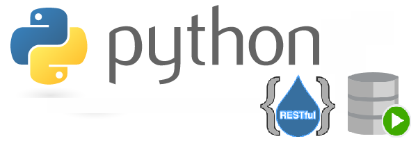

# Grupo de estudio BD y Servicios Restful en Python

# Contenido que vamos a estudiar

 [Presentación Temas del grupo de estudio](https://docs.google.com/presentation/d/1SEisiShJnT6mIKS3UhYhbg3EUdGu0F_Km-1nYkAIreg/edit?usp=drive_link){:target="_blank"}

# Sesiones

## Sesión 01: Hola mundo y repaso de módulos Python

### Slides

 [Presentación](https://docs.google.com/presentation/d/1RT8x815My8LgtLI68cLRwDvDV0M6MoSAvsAoS0iyw8U/edit?usp=drive_link){:target="_blank"}

### Repo con notas y código de ejemplo

 [ordev-python-bd-sql-restful/001-repaso-modulos-1](https://github.com/ordev-python-bd-sql-restful/001-repaso-modulos-1){:target="_blank"}

### Video de la sesión
 [Vídeo](https://drive.google.com/file/d/1vZmrxmNBCkX9ChccSs61QL33UMdpZfX7/view?usp=drive_link){:target="_blank"}

